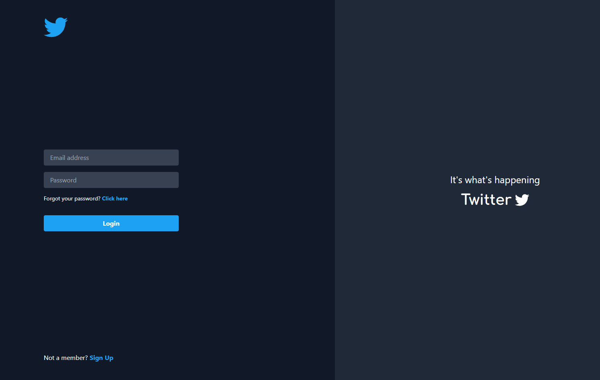

<!--- # "Can be a image or a gift from the project pages" -->

  

# Twitter Clone

O Twitter Clone é um projeto desenvolvido como trabalho final do curso Full Stack Python, utilizando React no front-end e Django no back-end. Ele reproduz funcionalidades essenciais de uma rede social, como criação de posts, interação com outros usuários e gerenciamento de contas. O objetivo é aplicar os conceitos aprendidos durante o curso, integrando tecnologias modernas para criar uma aplicação web completa e funcional.

## Tech Stack

<!--- # "Verify icons availability here https://github.com/tandpfun/skill-icons" -->

## License

This software is available under the following licenses:

- [MIT](https://rem.mit-license.org)